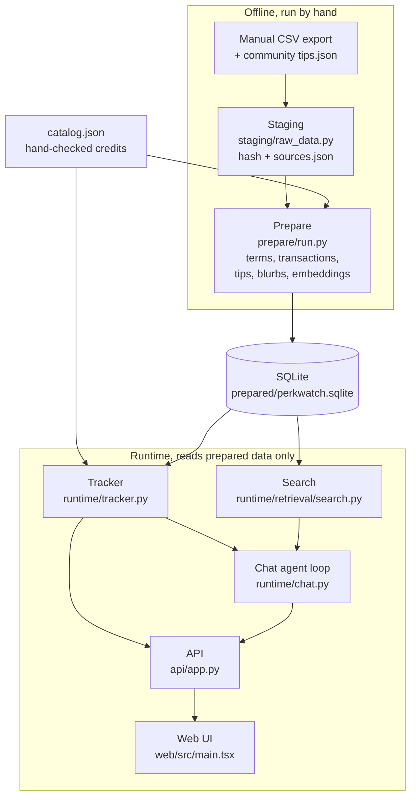
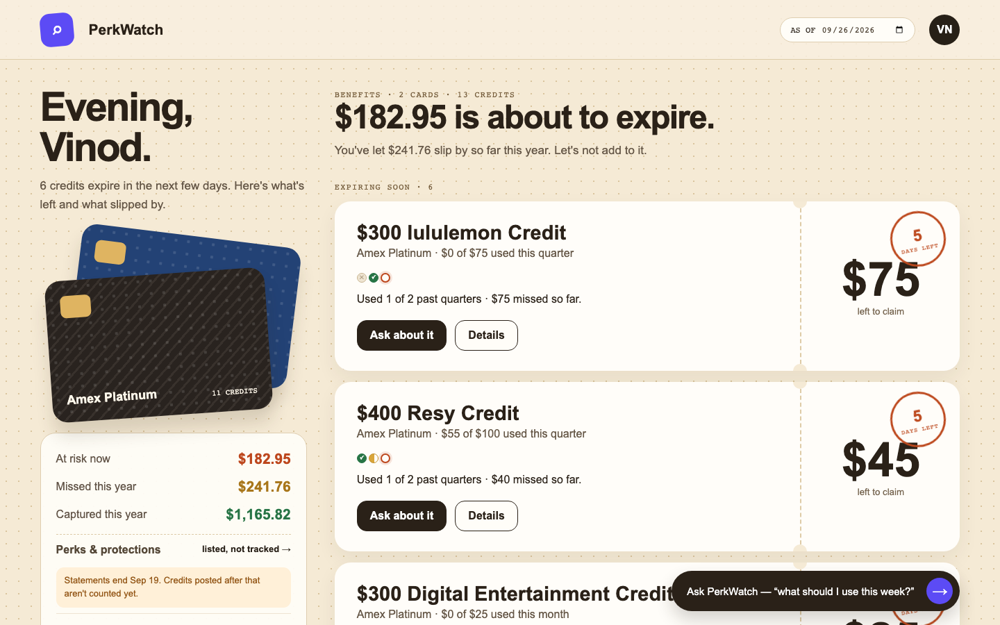
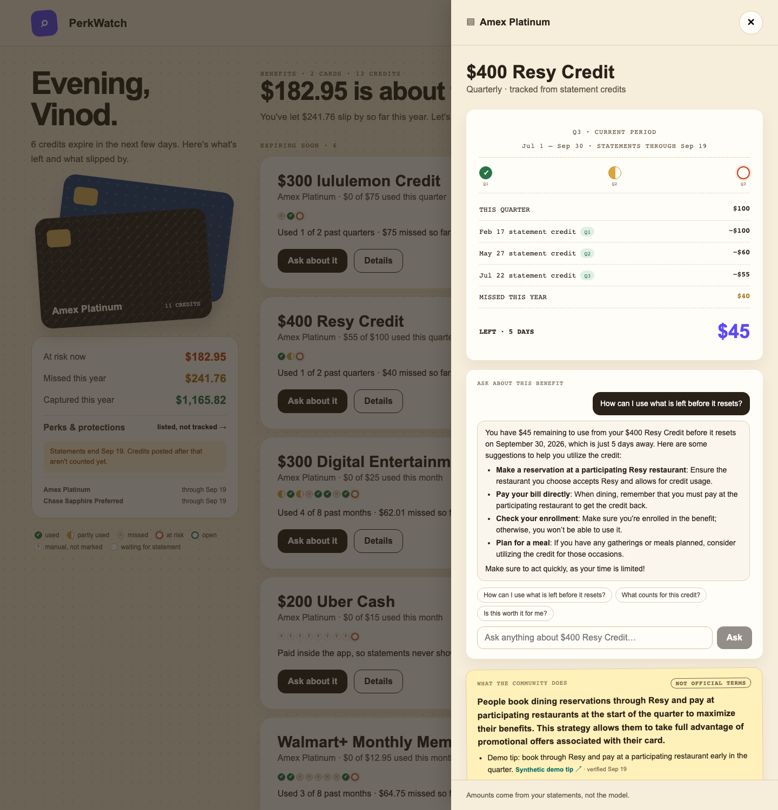
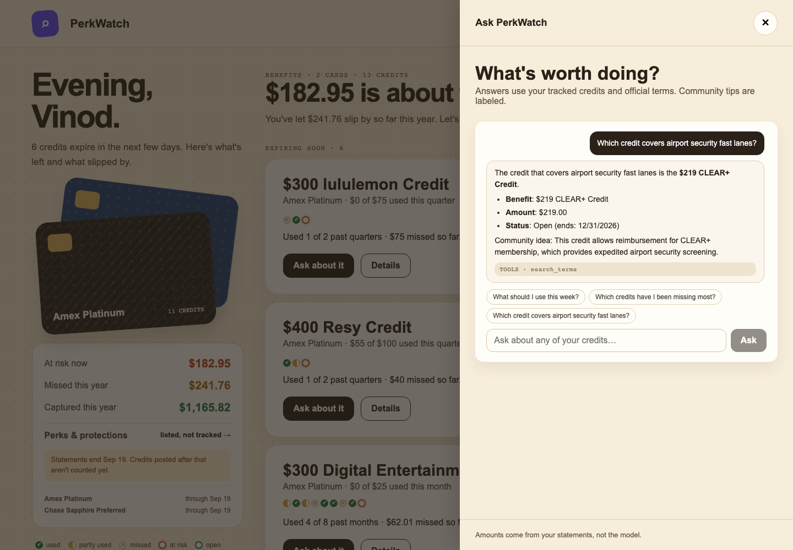

# PerkWatch

A credit-card benefit tracker that matches a commercial tracker (MaxRewards) on my own data: every statement credit, every period, **used / partial / missed / at risk** — plus a chat and a wallet-wide "Ask" that explain what to do next.

> **Design philosophy.** Every number — status, amount, deadline — is computed by code from statement lines; AI only explains it, writes a weekly plan, and proposes actions a tap confirms. It never decides a status. The project is deliberately small (a couple of cards, a hand-checked catalog of credits, my own data) — built to prove depth on a few hard problems, not issuer-count breadth.

## Architecture



**Offline** (above SQLite): collecting and preparing data are explicit, manual steps — no automated logins, no bank APIs. **Runtime** (below SQLite): the app only reads prepared data. Its one write is user-confirmed "mark used" for credits a statement can't show, and the agent's `propose_mark` tool can *offer* that mark but never writes it itself.

- **Tracker (`runtime/tracker.py`)**: walks every period of the year and gives each one a status — used, partial, missed, pending, unmarked, at risk, or open — from a hand-checked catalog of credits and a regex per credit over statement lines. No merchant matching, no LLM decides "used."
- **Search (`runtime/retrieval/search.py`)**: embeds official benefit terms (never transactions) and, when a question names a card, filters to that card first.
- **Agent loop (`runtime/chat.py`)**: a small tool-using loop (3-4 tools, at most 4 calls per turn) on `gpt-4o-mini`. A code-level grounding check flags any dollar amount in an answer that isn't in the context or a tool result. The model sees a credit's terms, tips, amounts and dates — never transaction descriptions or account details.
- **Evals (`evals/run.py`)**: tracker (status/amount correctness), retrieval (recall@3), and chat (code checks + an LLM judge for usefulness only).

## Screenshots







*All screenshots use synthetic demo data (`scripts/build_demo_data.py`), never a real account.*

## Run it locally

```sh
uv sync
export PERKWATCH_DATA_DIR="$HOME/perk-watch-local-data"   # keep this outside the repo
```

Build synthetic demo data and start the app (safe to run without any real card data):

```sh
uv run python scripts/build_demo_data.py --root "$HOME/perkwatch-demo"
uv run python scripts/prepare_data.py --data-dir "$HOME/perkwatch-demo"   # adds embeddings/blurbs; needs OPENAI_API_KEY
uv run --extra ui python scripts/serve.py --data-dir "$HOME/perkwatch-demo"   # API on :8000
cd web && npm run dev                                                        # UI on :5173
```

To track a real card instead, see the data-collection prompts and privacy rules below in [Adding or refreshing card data](#adding-or-refreshing-card-data).

## Verify it

```sh
uv run --extra ui python -m unittest discover -s tests
python3 scripts/check_local_data_guard.py
uv run python evals/run.py --suite tracker            # synthetic, no model calls
uv run python evals/run.py --suite all --real         # + real data, retrieval and chat (~20 OpenAI calls)
```

Last full run on real data: **tracker 31/31** periods matched a commercial tracker's answer key, **retrieval recall@3 8/8**, **chat 5/5** code checks with an LLM-judge mean of **4.2/5**.

Cost: preparing a card costs about 10 small OpenAI calls (blurbs + embeddings, cached between runs); a full eval run costs about 20 calls; a single chat or briefing reply costs 1-2 calls and returns in a few seconds.

Privacy/guardrails: only public issuer facts and credit-line patterns live in the committed catalog (`src/perk_watch/catalog.json`); raw guides, statements, and community sources stay local under `PERKWATCH_DATA_DIR` and are never committed; `redact_pii` runs before any text is embedded or sent to a model; and the model never sees transaction descriptions, account details, or complete transaction rows. See `AGENTS.md` for the full rules.

## Adding or refreshing card data

The shared `src/perk_watch/cards.json` lists supported cards. Adding a new one means: generate a stable card ID, inspect a sample export for columns and statement-credit sign, add its trackable credits to `src/perk_watch/catalog.json`, and add synthetic tests and an eval case — all before collecting any real data for it. Refreshing an existing card means staging new CSV/OFX exports and, separately, collecting current community tips from public pages. In every case, user login, MFA, CAPTCHA, account selection, and consent stay manual — nothing here automates them.
