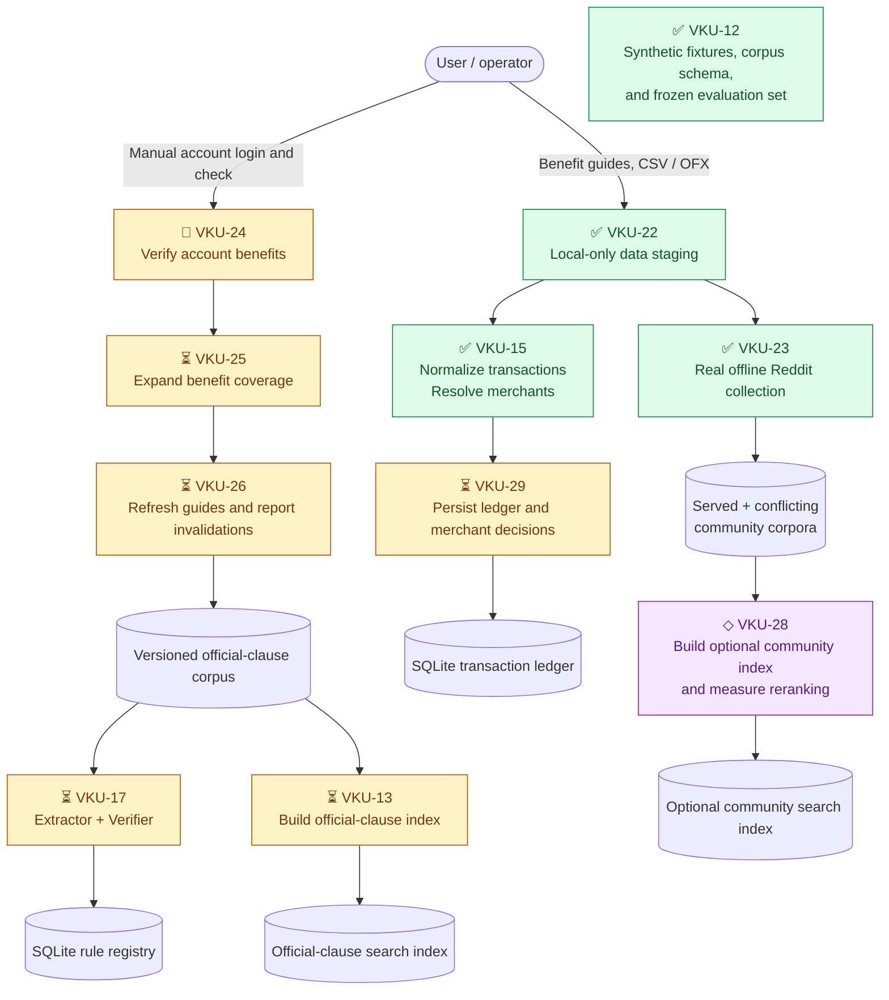
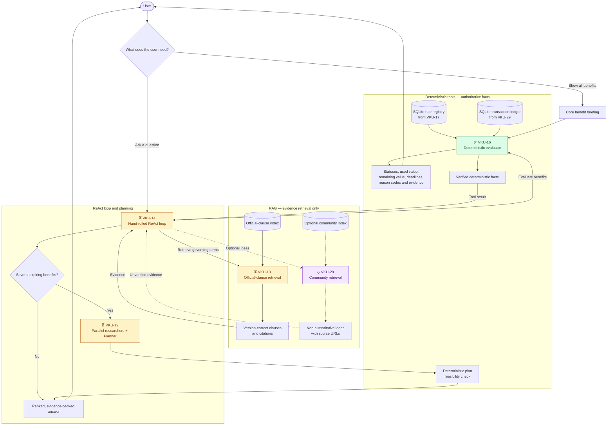
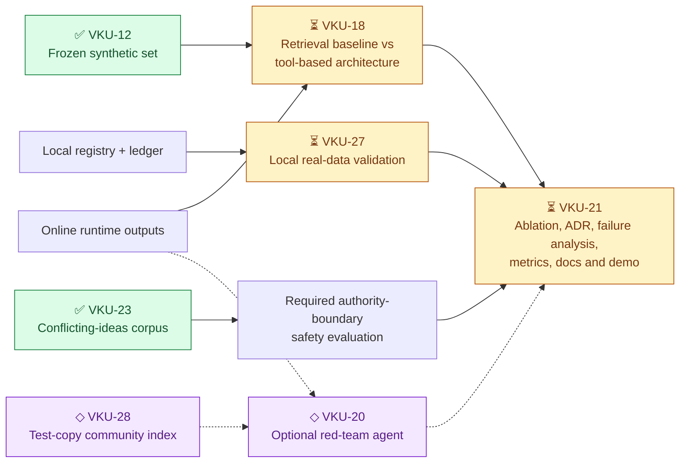

# PerkWatch architecture flow

PerkWatch separates data preparation from the user-facing runtime:

1. **Offline preparation** imports and versions local data, builds registries
   and indexes, and performs no end-user query handling.
2. **Online user flow** reads those prepared artifacts to produce a direct
   briefing or a conversational, evidence-backed plan.
3. **Evaluation** measures the system outside the product request path.

No user query fetches issuer pages or Reddit, parses PDFs, imports statements,
or changes the rule registry or indexes.

Ticket status symbols reflect the current Linear plan:

- ✅ Done
- ⏳ Backlog / remaining floor work
- ◇ Below-the-line optional work
- 👤 Manual user action

## Offline preparation flow

These jobs run manually or during an explicit import/refresh. Their outputs are
versioned, local artifacts consumed read-only by the online flow.



## Online user flow

The online path performs no source collection or ingestion. It reads the
prepared SQLite stores and search indexes.



## Evaluation and submission flow

Evaluation consumes the same prepared artifacts and runtime outputs, but it is
not part of an end-user request.



## Ticket-to-user-outcome map

| Ticket | Flow | Architectural role | User relevance |
|---|---|---|---|
| **VKU-12 ✅** | Offline + evaluation | Clause schema, fixtures, frozen set | Supplies reproducible test evidence, not runtime data |
| **VKU-22 ✅** | Offline | Local-only staging boundary | Safely receives manually supplied guides and exports |
| **VKU-15 ✅** | Offline | Transaction normalization and merchant resolution | Converts exports into structured evidence before queries |
| **VKU-23 ✅** | Offline + evaluation | Real offline community collection | Produces source-linked ideas and the safety corpus |
| **VKU-16 ✅** | Online | Deterministic authority | Returns exact statuses, values, periods, and deadlines |
| **VKU-24 👤** | Offline/manual | Account verification | Ensures prepared benefits match the actual account |
| **VKU-25 ⏳** | Offline | Benefit-scope expansion | Covers every benefit across both cards |
| **VKU-26 ⏳** | Offline | Guide refresh and invalidation | Prevents stale terms from reaching runtime |
| **VKU-29 ⏳** | Offline storage | SQLite ledger and merchant persistence | Makes runtime restart-safe and model-independent |
| **VKU-17 ⏳** | Offline storage | Extractor/Verifier and SQLite registry | Produces the only rules the online evaluator may use |
| **VKU-13 ⏳** | Offline build + online read | Official-clause index and retrieval | Supplies version-correct citations during a query |
| **VKU-14 ⏳** | Online | ReAct loop | Handles natural-language questions and explanations |
| **VKU-19 ⏳** | Online | Researchers and Planner | Produces one feasible multi-benefit action plan |
| **VKU-27 ⏳** | Evaluation | Local real-data validation | Measures account-accurate behavior outside runtime |
| **VKU-18 ⏳** | Evaluation | A-vs-B comparison | Measures deterministic tools against vanilla RAG |
| **VKU-21 ⏳** | Evaluation/submission | Final analysis and documentation | Consolidates evidence, failures, ADR, docs, and demo |
| **VKU-28 ◇** | Offline build + online read | Optional community index/retrieval | Adds ranked, non-authoritative usage suggestions |
| **VKU-20 ◇** | Evaluation | Optional generated adversary | Adds prompt-injection regression coverage |

## Authority boundary

### Deterministic authority

VKU-16, VKU-17, and VKU-29 own transaction occurrence, eligibility,
periods, amounts, remaining value, deadlines, and status. Model output cannot
change those facts.

### Model-authoritative merchant resolution

VKU-15 resolves a raw statement descriptor to a canonical merchant during
transaction ingest. VKU-29 persists that decision so the runtime briefing does
not need a model call. Missing or unresolved decisions produce an
`indeterminate` result rather than a guess.

### Model-assistive interaction

VKU-13, VKU-14, VKU-19, and optional VKU-28 retrieve evidence, explain verified
facts, and propose plans. The deterministic feasibility check rejects plan
items that exceed remaining value, miss a deadline, or violate known
constraints.

## Execution dependency map

```text
VKU-24 → VKU-25 → VKU-26 → VKU-13 ┐
                            → VKU-17 ├→ VKU-14 → VKU-19 → VKU-18 → VKU-21
VKU-15 + VKU-16 + VKU-22 → VKU-29 ┘             │
                                  VKU-17 + VKU-29 → VKU-27 → VKU-21

Optional:
VKU-13 + VKU-23 → VKU-28 → VKU-20
```

The immediate unblocked work is VKU-24 and VKU-29. VKU-24 requires manual
login, MFA, account selection, and consent; these steps must not be automated.
