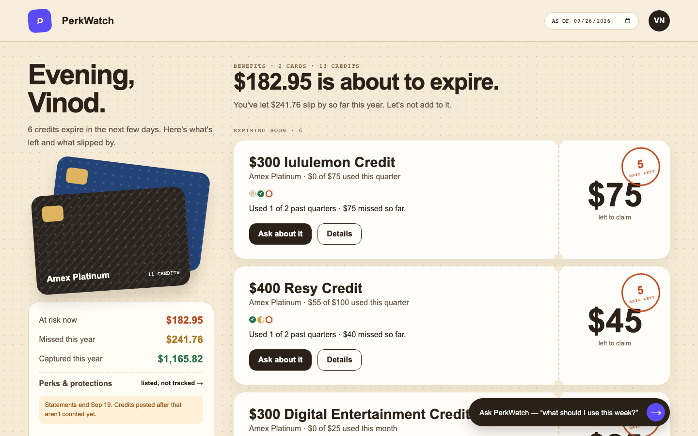
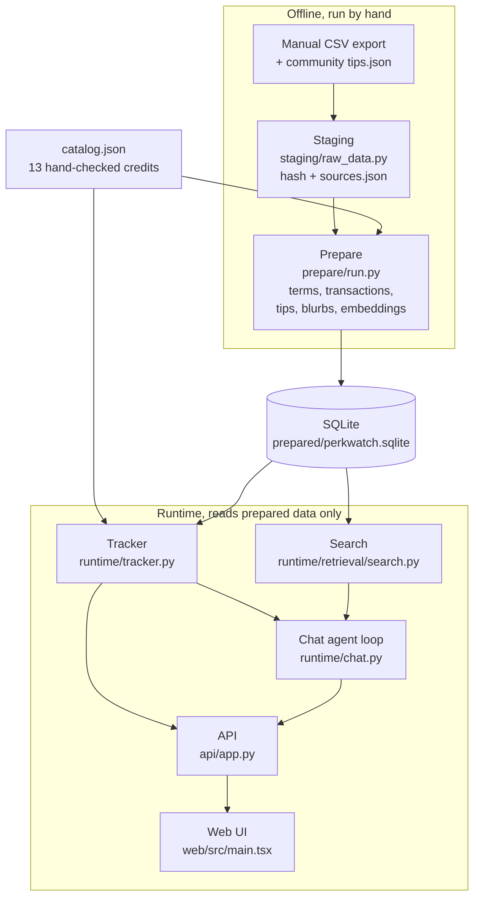
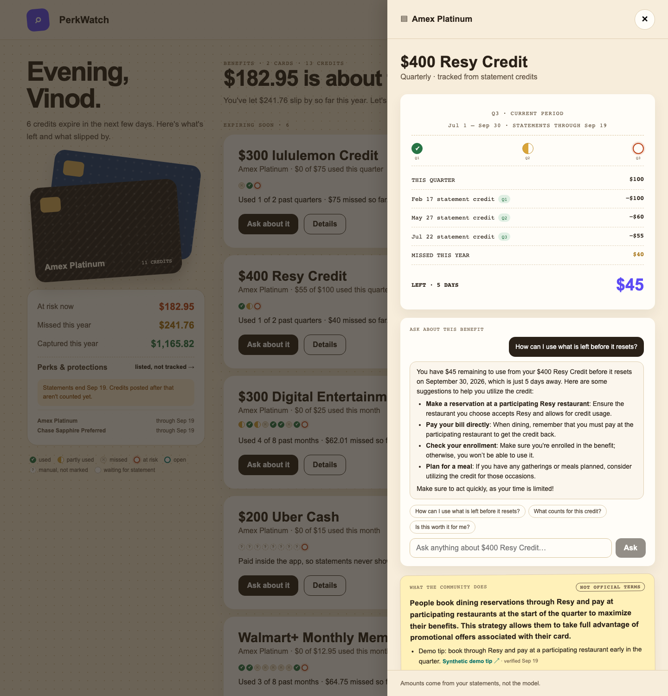

# PerkWatch: a credit tracker that matches a commercial one on my own data

PerkWatch tracks every statement credit on my cards, period by period (used, partly used, missed, at risk), and lets me ask an LLM how to use a credit before it expires. On my real 2026 data it agrees with MaxRewards on **31 of 31 periods**.



*All screenshots in this write-up use the synthetic demo data from `scripts/build_demo_data.py`, not my real account.*

## 1. The problem

**The goal.** I wanted a tracker like MaxRewards' benefits page (maxrewards.com/my/benefits):

- list every credit on the card;
- show used or missed for every period, not just the current one;
- flag credits about to expire;
- add what MaxRewards lacks: a per-benefit chat and community ideas.

**Why it's harder than it looks.** Measured on my real 2026 statements:

- **Merchant matching can't decide "used".** 1,337 of 1,362 transactions don't map to a known merchant, and a single unrecognised charge would leave a credit's status unknown.
- **The current period isn't enough.** "Missed" only exists if every period of the year is checked, not just this month or quarter.
- **Numbers and advice need different tools.** Amounts and deadlines must be exact, so code computes them; the LLM explains terms and suggests how to use what's left.

## 2. The key insight

The Amex export has **14 issuer statement-credit lines** in 2026. MaxRewards' Redeemed page lists **exactly those 14** auto-tracked redemptions.

So one regex per credit over the statement description (for example `PLATINUM DIGITAL ENTERTAINMENT CREDIT`) reproduces a commercial tracker. Deciding "used" needs **no merchant matching and no LLM**. The LLM is kept for what it is good at: explaining terms and suggesting how to use a credit.

## 3. Architecture



**Offline** (above SQLite): collecting and preparing data are explicit, manual steps. **Runtime** (below SQLite): the app only reads prepared data. Its one write is "mark used" for credits a statement can't show, saved to a local `profile.json`.

## 4. Capstone topics

### Fetching

- **What:** I export transactions as CSV myself. `src/perk_watch/staging/raw_data.py` copies each file into the local data root, names it by its SHA-256 hash, and records it in `sources.json`. Repeated files are recognised.
- **Why this way:** no automated logins, credential storage or bank APIs, by design (see [AGENTS.md](../../AGENTS.md)).
- **Community tips** are collected in a separate, explicit offline step as paraphrased, source-linked tips.

### Normalizing

- **Catalog:** [`src/perk_watch/catalog.json`](../../src/perk_watch/catalog.json) is hand-checked: **13 credits**, each with a per-period amount, a period (monthly, quarterly, semiannual, annual), a tracking mode (auto or manual) and a credit pattern. Loaded and validated by [`catalog.py`](../../src/perk_watch/catalog.py).
- **Prepare:** [`src/perk_watch/prepare/run.py`](../../src/perk_watch/prepare/run.py) builds the official terms library, parses and deduplicates transactions, loads tips, and caches a one- to two-sentence blurb per credit. It writes one SQLite file and a `report.json` that lists credit lines no pattern claims.
- **Tracker:** [`src/perk_watch/runtime/tracker.py`](../../src/perk_watch/runtime/tracker.py) walks every period of the year and gives each one a status: used, partial, missed, pending (statement not in yet), unmarked (manual credit not confirmed), at risk, or open.

### RAG

- **Search:** [`src/perk_watch/runtime/retrieval/search.py`](../../src/perk_watch/runtime/retrieval/search.py) ranks official terms by embedding similarity. If a question names a card ("Sapphire", "Amex"), search is filtered to that card first. That fix took recall@3 from **7/8 to 8/8**.
- **Per-benefit chat does not retrieve.** The benefit is known by ID, so its status, history, terms and tips are injected straight into the prompt. Retrieval earns its place in the wallet-wide Ask, where the right credit is not known in advance.
- **Transactions are never embedded.** They stay in SQLite.

### Agent loop

[`src/perk_watch/runtime/chat.py`](../../src/perk_watch/runtime/chat.py) runs a small tool-using loop on `gpt-4o-mini`:

- **3 tools:** `get_benefit_status`, `search_terms`, `get_community_tips`.
- **Max 4 tool calls** per turn, then the model must answer.
- **Grounding check in code:** every dollar amount in the answer must appear in the context or a tool result. Any that don't are flagged in the UI ("Not found in your data").
- **Privacy:** the model sees amounts, dates, terms and tips, never transaction descriptions or account details.




### Evals

[`evals/run.py`](../../evals/run.py) has three suites (cases in [`evals/cases.json`](../../evals/cases.json), scoring in [`evals/suites.py`](../../evals/suites.py)):

| Suite | Checks | Needs |
|---|---|---|
| **tracker** | status and amount of every period | nothing (synthetic); `--real` adds my local MaxRewards answer key |
| **retrieval** | recall@3 of the right credit for plain-language questions | real data + OpenAI key |
| **chat** | code checks (remaining amount, deadline, no unverified $, labelled tips, expected tool) + LLM judge for usefulness 1 to 5 | OpenAI key |

My MaxRewards account is the answer key. It is transcribed locally and never committed.

## 5. Course concepts

How PerkWatch maps to the AI Engineering Cohort syllabus, week by week, is in [Course concepts](course-concepts.md). In short: RAG, hands-on RAG, agents, evals and system design are used in depth; LLM fundamentals and context engineering in part; fine-tuning and multimodal not at all; and prompt injection is an open gap.

## 6. How it was built

1. **Analysis** with subagents: measure what my real statement data can and can't support.
2. **Throwaway prototype** on real data (branch `prototype/benefit-tracker`) to prove the regex idea before writing production code.
3. **UI first:** the page layout was settled from the prototype before the backend was built.
4. **Production build** with 3 parallel subagents (API, prepare, evals), then review and merge.

## 7. Results

Measured on my real data on 2026-09-26, except where noted.

| Measure | Result |
|---|---|
| Tracker vs MaxRewards answer key | **31/31 periods** correct on status and amount |
| Tracker, synthetic edge cases | **23/23 periods** (re-run 2026-09-26) |
| Amex "left this period" | **$1,370.95** vs MaxRewards "$1,371 left" |
| Year to date | captured **$635.33**, missed **$514.27**, at risk now **$137.95** |
| Retrieval recall@3 | **7/8 → 8/8** after the card filter |
| Chat code checks | **5/5** (4/5 before a prompt fix that puts "remaining amount + deadline" first) |
| Chat LLM judge (usefulness) | mean **4.2/5** (3.6 before the same fix) |
| Community tips | **48** source-linked tips across all **13** credits; 5 "no longer works" tips excluded |
| Unit tests | **67 pass** |

The at-risk $137.95 is Walmart+ $12.95, Uber Cash $15, Resy $100 and DoorDash $10.

## 8. Known gaps

- **7 of 11 auto credit patterns are unverified.** Those credits haven't posted a statement line yet, so their regex has never matched real data.
- **Anniversary-year resets are not modelled.** All periods follow the calendar.
- **Embeddings are rebuilt on every prepare**, even when terms are unchanged.
- **Manual credits** (Uber Cash, DoorDash) are only as good as the user's "mark used" clicks.
- **Statements lag.** My data runs through Sep 18/19, so recent periods show "waiting for statement" rather than missed.
- **The grounding check proves an amount exists, not that it is the right one.** In one run on synthetic demo data, the wallet Ask quoted CLEAR+'s full $219 instead of the $10 left, and called an official term a "Community idea". The code check passed because $219 is in the context.
- **No prompt-injection defense.** Tips and terms go into the prompt as trusted text (see [the prompt-injection gap](course-concepts.md#gap-prompt-injection)).

## 9. What I'd do next

1. **Verify the 7 unproven patterns** as those credits post, using the `report.json` list of unmatched credit lines.
2. **Model anniversary resets** by storing each card's open date in `profile.json` (the design planned this field; it isn't there yet).
3. **Rebuild embeddings only for changed terms**, using the content hash search already checks.
4. **Tighten grounding:** check that the "left" amount the answer states equals the tracker's remaining amount, and add wallet cases to the chat eval.
5. **Reminders:** a weekly "expiring soon" digest from the same tracker output.
6. **Treat tips and terms as data:** wrap them in marked blocks the model is told not to obey, with an injected-tip test.

## 10. Reproduce

```sh
uv sync
uv run --extra ui python -m unittest discover -s tests
uv run python evals/run.py --suite tracker            # free, no network
uv run python evals/run.py --suite all --real         # real data, about 20 OpenAI calls
```

To run the app on synthetic data, follow the setup in the [demo script](demo-script.md). Design detail: [design doc](../explanation/perk-watch-v3-benefit-tracker.md). Setup and data rules: [README](../../README.md), [CONTEXT](../../CONTEXT.md).
