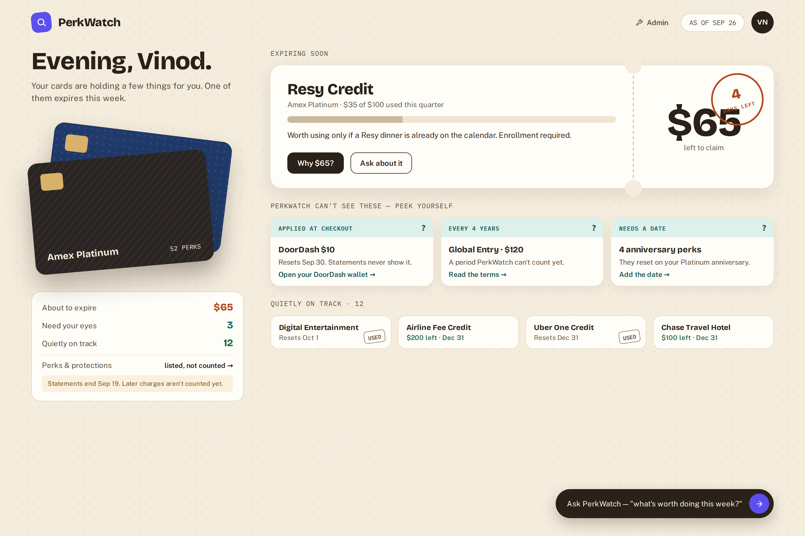
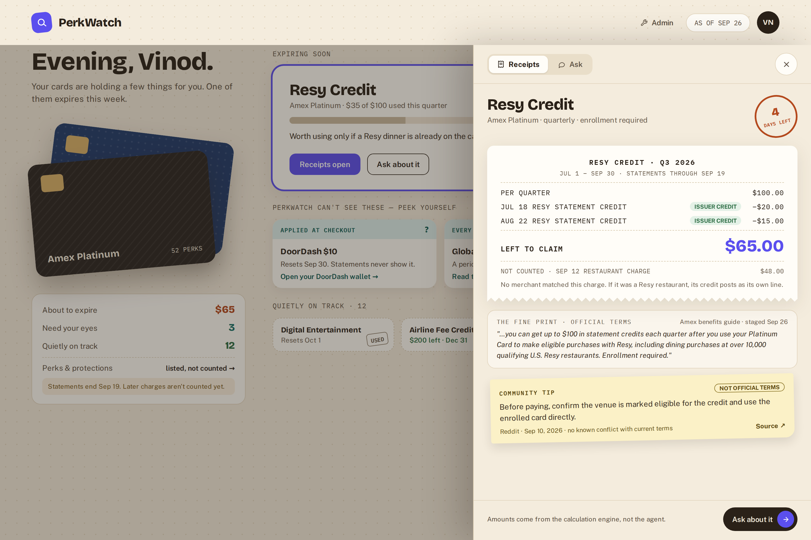
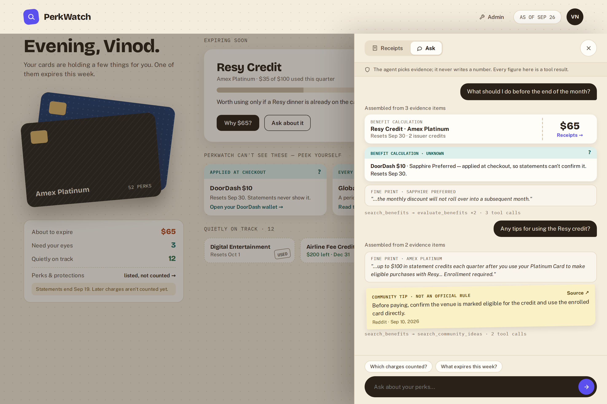

# PerkWatch V2 Phase 8: App UI

Put a read-only web interface over the existing runtime: a briefing, an evidence rail, and an Ask rail on one screen. See [PerkWatch V2 design](perk-watch-v2-design.md) and the [designs](#designs) below.

## Goal

A user opens one page and sees which credits need attention, why PerkWatch reached each conclusion, and can ask a follow-up question. Every amount, date, status, and citation on screen comes from a runtime function or tool result. The app never collects, imports, or changes data.

## Designs

Direction A, the coupon wallet, was chosen from three explored directions (all three are on the canvas). Credits are coupons that expire: the briefing uses coupons with a days-left stamp, "?" tickets for what PerkWatch cannot see, and stamped stubs for what is on track. One screen, one right rail with two tabs. On screen the evidence tab reads "Receipts"; the API and code keep the name evidence. Benefit names, card names, and counts come from prepared data as of 2026-09-26. Usage amounts and transaction rows are illustrative, and the web build follows these layouts rather than pixel values. The editable source is the [design canvas](https://claude.ai/code/artifact/d562117a-d3cb-48fd-b74b-37d4ef63110a), a private claude.ai artifact.

**Briefing** (slice 8.2)

**Briefing with the Receipts (evidence) rail** (slice 8.3)

**Briefing with the Ask rail** (slice 8.4)

## Starting point

Already built and reused as-is:

- `calculate_all` and `calculate_benefit` return status (`available`, `exhausted`, `unknown`), used and remaining amounts, deadline, reason, and supporting transaction IDs.
- `search_benefits`, `search_community_ideas`, and `get_transaction_evidence` return official terms with source references, labeled community ideas, and referenced transactions.
- `answer_with_db` runs the bounded tool loop. The model selects evidence indexes and never writes facts.
- `prepared/report.json` holds preparation counts and timestamps.

Missing:

- An HTTP API.
- A structured answer. `answer_with_db` returns rendered text, not the selected evidence.
- Match provenance on a calculation. `merchant_matches.confidence` and `credit_matches.confidence` exist per transaction but are not returned.
- Rows that were considered but not counted. `calculate_benefit` skips them silently.
- A benefit kind. Points, perks, and protections are stored like credits (for example, a points cap stored as `amount_minor` 50000000).

On the current real data every benefit resolves to `unknown` (as of 2026-09-26: 28 amount missing, 19 blocked by unmatched charges, 11 period not calculable, 5 eligible merchants missing). The demo therefore runs on a synthetic demo data root until slice 8.5 or [Phase 9](perk-watch-v2-phase-9-admin-ui.md) changes that.

## Decisions

- **API.** FastAPI and uvicorn in an optional `ui` dependency group, so the CLI stays light. Read routes live in `src/perk_watch/api/app.py`, started by `scripts/serve.py`. The server binds to `127.0.0.1` only, opens SQLite read-only per request through `runtime.app.database`, sets a short busy timeout, and has no write routes. No route accepts a data root, file path, or SQL from the request. There is no authentication because nothing listens beyond localhost.
- **Web.** `web/` is a Vite, React, and TypeScript app. Port the coupon-wallet design (Bricolage Grotesque, Public Sans, IBM Plex Mono; a warm dotted paper ground, coupon, receipt, and sticky-note surfaces, and one accent) into `web/src/theme.css`. Do not name it `tokens.css`: `.gitignore` ignores every path containing "token".
- **Grouping lives in Python.** `src/perk_watch/runtime/briefing.py` turns calculations into briefing groups so the CLI, API, and tests agree. The web layer only formats.
- **Money stays in minor units** through the API. Only the web layer formats currency.
- **Demo data root.** Tracked synthetic seed files live under `demo/seed/`. The local-data guard rejects tracked paths containing `/raw/` or `/prepared/`, so the seed is not a data root itself. `scripts/build_demo_data.py --root DIR` stages the seed through `perk_watch.staging.raw_data` into `DIR/raw/` and runs `prepare()`, exercising the real pipeline. Seed merchants use the matcher's current vocabulary (`uber`, `doordash`, `nytimes`, …) until Phase 9 adds a merchant dictionary. Real card data is never shown in a demo.

Briefing groups:

| Engine result | Briefing group |
|---|---|
| `available`, remaining > 0, deadline within the window (default 14 days, `window_days` parameter) | Act soon |
| `available`, deadline outside the window | On track |
| `exhausted` | On track (used) |
| `unknown` | Check yourself, with the engine `reason` shown in plain language |

"Partially used" is a flag (`available` and used > 0), not a new status. The engine keeps its three statuses.

## Slices

Build in order. Each slice ends with something that can be shown.

### 8.1 Read API and demo data

Backend only, no calculation change.

- [x] Add `demo/seed/` with structured terms JSON (required fields present, so no LLM extraction is needed) and CSV exports for `amex_platinum` and `chase_sapphire_preferred`. Include explicit statement-credit rows, purchases at matcher merchants, and one case that must stay `unknown`. Choose dates so that as of 2026-09-26 one quarterly credit is partly used and resets September 30.
- [x] Add `scripts/build_demo_data.py --root DIR`. It refuses a root inside the repository.
- [x] Add `runtime/briefing.py` with the grouping rules above, the stale-statement check (as-of date later than the last posted date), and reason grouping for `unknown`.
- [x] Add read routes: `GET /api/status` (cards, per-card posted-date range, last preparation time and counts), `GET /api/briefing?as_of=&account_year_start=&window_days=`, `GET /api/benefits/{benefit_id}?as_of=`, and `GET /api/benefits/{benefit_id}/transactions?as_of=`.
- [x] Add `scripts/serve.py`.

Show: on the demo root, `/api/briefing` returns one Act soon credit, a few Check yourself items, and the rest On track. On real data it returns every benefit under Check yourself, grouped by reason.

### 8.2 Briefing screen

Web only. Design: [briefing](perk-watch-v2-ui-app-briefing.png).

- [x] Header with an as-of pill driven by the `as_of` query parameter.
- [x] Act soon coupons with a tear-off stub and days-left stamp, Check yourself "?" tickets (one plain-language reason and one action each), and On track stubs stamped "USED" when exhausted.
- [x] Wallet column: the card stack, group counts, the Perks & protections entry, and the stale-statement warning. Per-card transaction ranges and the last preparation time come from `/api/status`.
- [x] Motion: amounts count up on load and the stamp lands once. Both are off under `prefers-reduced-motion`.
- [x] An empty state for data where nothing can be calculated. It groups the reasons and links to Admin rather than showing 63 identical cards.

Show: demo narrative 0:30–1:15, the briefing on a date near a period boundary.

### 8.3 Evidence rail

Query-only additions to the API. No calculation change. Design: [evidence rail](perk-watch-v2-ui-app-evidence.png).

- [x] Route-backed rail (`?benefit=<id>`). The back button closes it, and the URL is shareable locally.
- [x] The tab reads "Receipts" on screen.
- [x] Official terms and source reference from the benefit row and `sources`, shown as fine print.
- [x] Receipt: amount per period, each counted credit or charge, the amount left, not-counted lines, period bounds, and the statements-through date.
- [x] Transactions with `matched_by` (`issuer_credit`, `merchant_exact`, `merchant_model`), from joining `credit_matches` and `merchant_matches` to the supporting IDs.
- [x] `GET /api/benefits/{benefit_id}/community`: current community ideas for that benefit by direct SQL, with no embedding call. Show them as a sticky note labeled "Not official terms", with source date and link.

Show: demo narrative 1:15–1:55 (evidence) and 1:55–2:25 (open a Check yourself item and show why the engine refuses to guess).

### 8.4 Ask rail

The agent returns structure. CLI output is unchanged. Design: [Ask rail](perk-watch-v2-ui-app-ask.png).

- [ ] Split `answer_with_db` into `run_agent(...) -> AgentResult` (evidence items, selected indexes, tool trace, stop reason) and a renderer. `answer_with_db` becomes `render(run_agent(...))`, so `scripts/ask.py` and `evals/` keep working unchanged.
- [ ] `POST /api/ask {question, as_of}` returns only selected evidence items, typed by tool, plus the trace and stop reason. It returns no generated prose.
- [ ] Render one card per evidence item by tool: calculations as coupons, unknown results as "?" tickets, official terms as fine print, transactions as receipt lines, and community suggestions as sticky notes labeled "Not an official rule". Show the tool trace in one line.
- [ ] Evidence and Ask share the rail as tabs with preserved state. A citation opens the Evidence tab for that `benefit_id`.
- [ ] Render call-limit, retry-exhaustion, and no-evidence outcomes as distinct states.

Show: demo narrative 2:25–2:45, "What should I do before the end of the month?"

**Demo cut:** slices 8.1–8.4 on the demo root are a complete app demo.

### 8.5 Real-data readiness (optional before the demo)

Engine change, measured with new eval cases.

- [ ] **Issuer-credit-based benefit mapping:** statement-credit usage counts issuer-posted credits matched to the benefit, never qualifying purchases. Select the active monthly, quarterly, half-yearly, or yearly period from `as_of` (today when omitted), and distinguish (1) credit confirmed, (2) no credit found with statement coverage through the active period, and (3) unverifiable because statement coverage is incomplete.
- [ ] Accept explicit half-yearly cadence as two calendar half-years and calculate its period boundaries.
- [ ] Preserve unknown matches: ambiguous credits are not assigned or counted, and a transaction cannot be counted twice. Add deterministic tests/eval coverage for quarterly Resy-style and monthly Uber-style credits, incomplete statement coverage, ambiguity/double counting, and non-statement benefits.

- [ ] Add a benefit `mechanism` field: `statement_credit`, `checkout_discount`, `in_app_cash`, `points`, `perk`, or `protection`. Extract it with the existing extractor boundary and store it using the same migration pattern as `community_ideas.source_date`.
- [ ] For `statement_credit`, compute usage from explicit issuer credits only. Unrelated unmatched charges can no longer block the benefit, and a purchase plus its own credit is no longer counted twice.
- [ ] For `checkout_discount` and `in_app_cash`, return `unknown` with the reason "applied outside statements" (for example, the DoorDash monthly discount).
- [ ] Exclude `points`, `perk`, and `protection` from credit calculations and list them under Perks & protections.
- [ ] Return `not_counted` rows with a reason, such as a credit line that matched two benefits equally and was dropped.
- [ ] Add a display title that strips trailing `:` and `*` artifacts. Stored titles do not change.
- [ ] Add eval cases: a statement credit alongside unrelated unmatched charges, a purchase plus its credit, a checkout discount, and a points benefit that never shows a dollar remainder.

Show: the same screens on real data, viewed privately.

## Done when

- One command starts the API, and the web app renders the briefing, evidence rail, and Ask rail against the demo root.
- Every figure on screen maps to a calculation or tool result. The web layer computes no amounts, dates, or statuses.
- The Ask rail shows only model-selected evidence. It can display no fact that no tool returned.
- `scripts/ask.py` output and the full Phase 5 evaluation are unchanged by slices 8.1–8.4.
- The API cannot write the prepared database, and it listens only on localhost.

## Checks

- API tests use FastAPI's test client against the synthetic `evals/fixture.sqlite`: status, briefing groups, evidence joins, and community by benefit.
- A write attempted through the API connection fails (read-only URI).
- No route accepts a path, a data root, or SQL. Unknown benefit IDs return 404, not a traceback.
- Ask route tests reuse the planned deterministic client from `evals/harness.py`.
- The local-data guard passes. No demo output, SQLite file, or real export is tracked.

## Depends on

[Phase 5: Evaluation and search improvements](perk-watch-v2-phase-5-evaluation.md). [Phase 7: Local tracing](perk-watch-v2-phase-7-local-tracing.md) is optional; when present, show the trace ID in the Ask rail.
