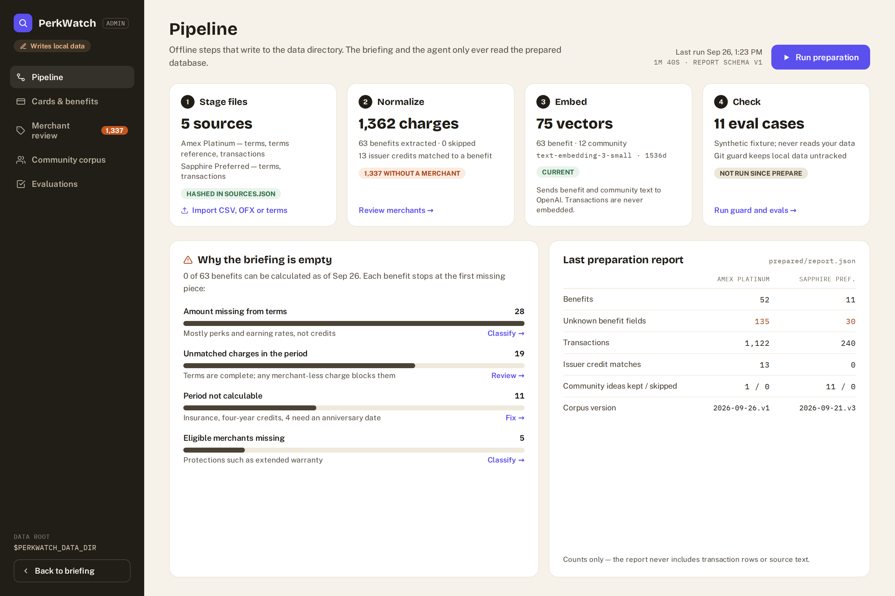
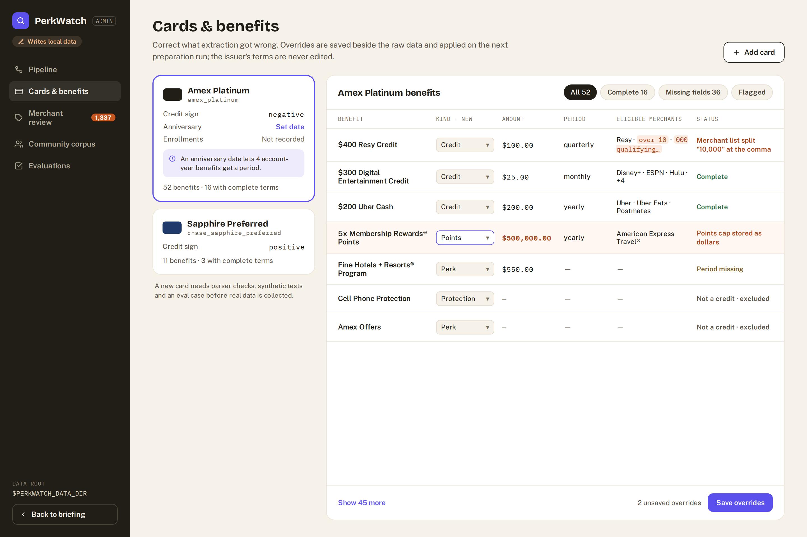
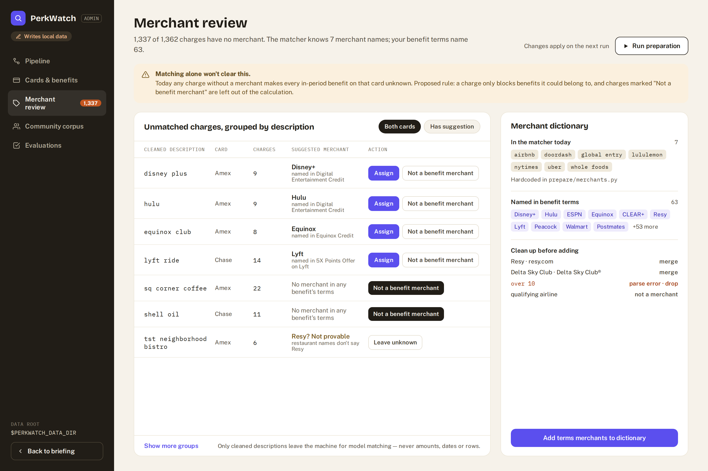

# PerkWatch V2 Phase 9: Admin UI

> **Superseded by V3.** This page records the V2 question-answering design and is kept as history. The current design is the [V3 benefit tracker](perk-watch-v3-benefit-tracker.md).

Add a local admin page that runs the existing offline steps and corrects what extraction and merchant matching got wrong, without weakening the read-only runtime. See [PerkWatch V2 design](perk-watch-v2-design.md) and the [designs](#designs) below.

## Goal

From one local page, a user can see the state of prepared data, stage files, run preparation, and fix the gaps that keep benefits `unknown`. The briefing and the agent remain strictly read-only.

## Designs

A separate admin area with its own navigation and a "Writes local data" marker. Benefit names, card names, and counts come from prepared data as of 2026-09-26. Usage amounts and transaction rows are illustrative, and the web build follows these layouts rather than pixel values. The editable source is the [design canvas](https://claude.ai/code/artifact/d562117a-d3cb-48fd-b74b-37d4ef63110a), a private claude.ai artifact.

**Pipeline** (slices 9.1–9.3)

**Cards & benefits** (slice 9.5)

**Merchant review** (slice 9.4)

## Starting point

Already built and reused as-is:

- Staging: `import_benefit_guide` and `import_transactions` (with a `root` argument) hash and register files in `sources.json`.
- Preparation: `prepare.run.prepare()` extracts, normalizes, deduplicates, matches, filters community ideas, embeds, and writes SQLite in a single commit. It then writes `prepared/report.json`.
- Checks: `scripts/check_local_data_guard.py` and `evals/run.py`.
- Community corpus versions: dated directories under `raw/<card>/community/`.

Missing:

- A way to run any of these except the command line.
- Anywhere to store corrections. `MERCHANTS` is a hardcoded seven-name tuple in `prepare/merchants.py`, while benefit terms name 63 merchants. Extracted benefit fields have no override. Nothing stores the account anniversary or enrollment state.
- A per-transaction decision that a charge is irrelevant. Today every unmatched charge in a period makes each benefit on that card `unknown`.

## Decisions

- **Separate writer process.** Admin routes live in `src/perk_watch/api/admin.py`, started by `scripts/admin.py` on its own localhost port. The read app never imports it. When the admin server is down, the web `/admin` routes show "Admin server not running", and the briefing keeps working.
- **Corrections are data, not code edits.** Admin writes only under the data root:
  - staged files, through the existing staging functions
  - `overrides/benefits.json`
  - `overrides/merchants.json`
  - `profile.json` (account anniversary and enrollment per card)

  Raw files and issuer terms are never edited. `prepare()` applies overrides after extraction, and the report counts how many were applied.
- **Long work runs as jobs.** Preparation, guard, and evals run in a background worker with a single-flight lock in `prepared/`. The job record holds state, start and end times, and the same summary `prepare_data.py` prints. Preparation still commits once, so the app sees either the previous data or the new data, never a half-prepared card.
- **Collection stays outside the app.** Issuer login, MFA, export, and Reddit collection remain skill-driven offline actions, as `AGENTS.md` requires. Admin shows corpus versions and counts. It never fetches.
- **Costs are shown before they are spent.** Actions that call OpenAI (preparation with a key, evals) state what text leaves the machine and ask for confirmation.
- **The card catalog stays code.** `cards.json` is package data, and a new card needs parser checks, synthetic tests, and an eval case (README step 2). Admin shows the catalog read-only and links that checklist.

This phase reverses the design's earlier "no human review workflow" decision. Review is limited to local overrides that are applied at preparation time and visible in the report.

## Slices

Build in order. Each slice ends with something that can be shown.

### 9.1 Pipeline view

Read-only admin API. Design: [pipeline](perk-watch-v2-ui-admin-pipeline.png).

- [ ] `GET /admin/pipeline`:
  - per-card sources from `sources.json` (kind, staged time, no paths shown in the UI)
  - the last report's counts and timings
  - embedding model, dimensions, and vector counts
  - community corpus versions
- [ ] Show four stage cards (stage files, normalize, embed, check) and the last-report table.

Show: the admin page with real counts and no rows or text.

### 9.2 Why the briefing is empty

Read-only.

- [ ] `GET /admin/diagnostics?as_of=` groups `calculate_all` reasons: amount missing, blocked by unmatched charges, period not calculable, eligible merchants missing. Each group links to the screen that fixes it.

Show: on real data, "0 of 63 benefits can be calculated", broken down. This is honest uncertainty at the data level.

### 9.3 Stage and run

The first writes.

- [ ] `POST /admin/stage` (multipart: card, kind, file) calls the existing staging functions with the admin data root. It shows the recognized-duplicate result as "already staged".
- [ ] `POST /admin/prepare` starts a job. `GET /admin/jobs/{id}` polls it. Show a progress state, then the summary.
- [ ] After a successful run, the briefing picks up new data on its next request, with no restart.

Show: on the demo root, stage a new synthetic September CSV, run preparation, and watch the Act soon credit change. This is the "continuing product" moment.

**Demo cut:** slices 9.1–9.3.

### 9.4 Merchant review

Design: [merchant review](perk-watch-v2-ui-admin-merchants.png).

- [ ] The merchant dictionary becomes `MERCHANTS` plus `overrides/merchants.json`.
- [ ] Suggest additions from the union of benefit `eligible_merchants`, after cleanup:
  - merge `®` and domain variants (`Resy` and `resy.com`, `Delta Sky Club` and `Delta Sky Club®`)
  - drop parse fragments such as `over 10` (from "over 10,000" split at the comma)
  - flag non-merchants such as `qualifying airline`
- [ ] Group the review queue by cleaned description, with card and count, from `report.json` unresolved entries. Rows stay local. The existing model-safe matching path is the only thing that ever leaves the machine.
- [ ] Decisions per cleaned description:
  - assign a merchant
  - mark "not a benefit merchant" (stored as confidence `none`)
  - leave it unknown
- [ ] `match_all` applies stored decisions before substring or model matching. `calculate_benefit` ignores confidence `none` when counting uncertain charges.
- [ ] Add eval cases: an unrelated charge marked `none` no longer blocks a benefit, and an assigned merchant starts counting.

Show: mark coffee and fuel charges as not benefit merchants, rerun, and watch several benefits move out of Check yourself.

### 9.5 Cards and benefits

Design: [cards and benefits](perk-watch-v2-ui-admin-cards.png).

- [ ] `profile.json` per card holds the account anniversary and enrollment flags. The runtime reads the anniversary as the default `account_year_start`, which gives four Amex account-year benefits a period.
- [ ] Benefit overrides cover `mechanism` (from 8.5), amount, period, and eligible merchants. The UI shows the extracted value beside the override.
- [ ] Flags:
  - credit amounts implausible for a credit (a points cap stored as $500,000)
  - merchant fragments
  - a missing period
  - statement credits dropped because two benefit titles tied (for example, several titles sharing "Resy")
- [ ] The report lists applied overrides by benefit ID.

Show: fix the Resy merchant list and the points benefit, rerun, and show both correct in the briefing.

### 9.6 Checks and evaluations

- [ ] Run the local-data guard and evals as jobs.
- [ ] Save eval JSON under `prepared/evals/` instead of `/tmp`, and show factual and live-agent pass counts, failed cases, and API usage.
- [ ] Show the community corpus read-only: versions, kept and skipped counts, and source dates.

Show: demo narrative 2:45–3:00, the evaluation result, from the admin page.

## Done when

- The admin server runs as a separate localhost process. With it stopped, the app and CLI work unchanged.
- Staging, preparation, guard, and evals can run from the page. Every run produces the same outputs as the command line.
- Overrides and merchant decisions live only under the data root, are applied during preparation, and are counted in the report.
- No admin action collects issuer or Reddit data, stores credentials, or edits raw files, issuer terms, or `cards.json`.

## Checks

- Admin API tests against a temporary data root built from the synthetic seed: stage, duplicate stage, prepare job, and concurrent prepare rejected by the lock.
- The read API has no route that writes. Import boundaries are tested so `api/app.py` never imports `api/admin.py`.
- Overrides round-trip: prepare, override, prepare again, and the value changes with the report showing it. Removing the override restores the extracted value.
- Merchant decisions never send amounts, dates, transaction IDs, or full rows to a model.
- The full test suite, the local-data guard, and the Phase 5 evaluation pass after slices 9.4 and 9.5.

## Depends on

[Phase 8: App UI](perk-watch-v2-phase-8-app-ui.md) slice 8.1 (shared API package and demo root). Slice 9.5 uses `mechanism` from slice 8.5.
