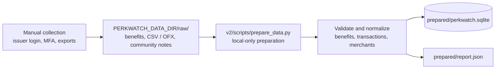
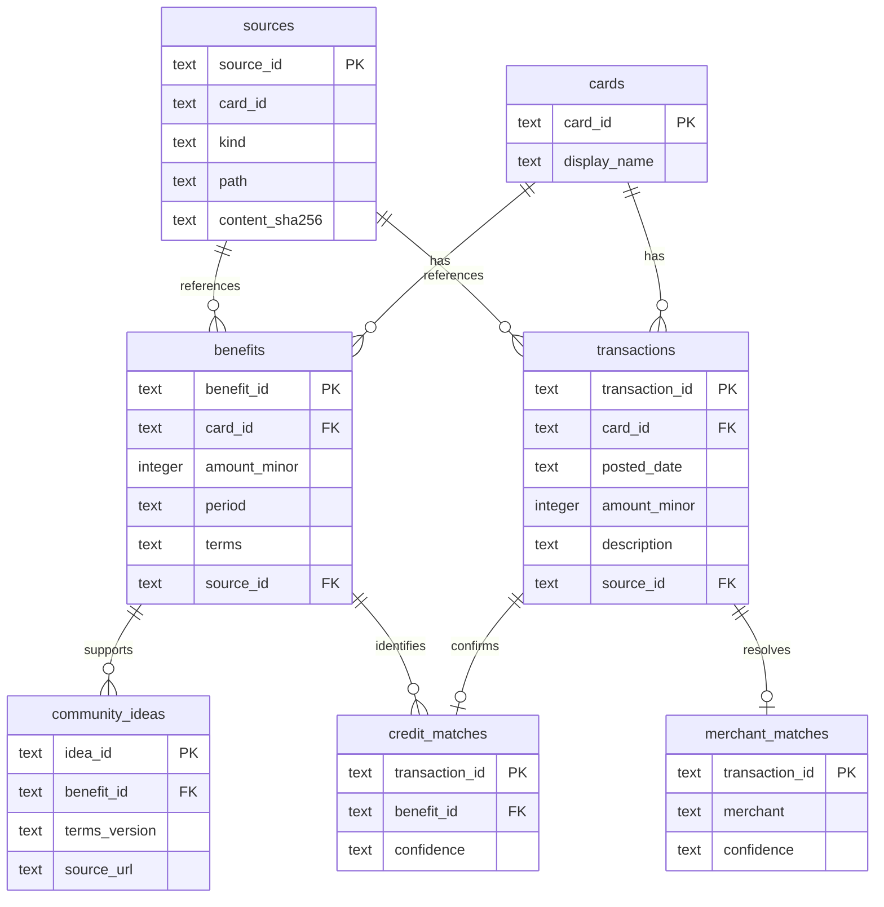

# PerkWatch V2 Phase 1

## Local-data preparation flow

Issuer login, MFA, account selection, transaction export, and any consent are
manual. Preparation does not contact issuers or Reddit. Real inputs and
prepared outputs remain under `PERKWATCH_DATA_DIR`.

## SQLite structure

`amount_minor` stores integer cents. Transaction IDs are stable hashes, so
overlapping exports do not create duplicate ledger rows. Unclear benefit fields
remain unknown, unresolved merchant matches are recorded rather than invented,
and only explicit unambiguous statement credits become credit matches.
