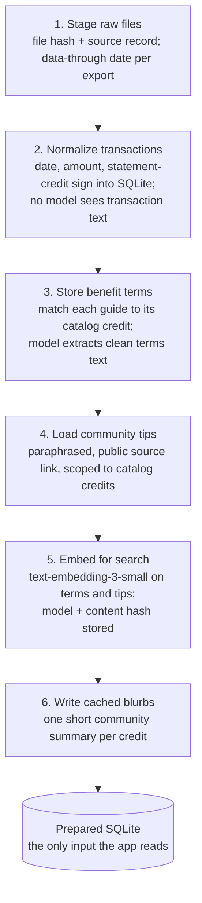

# PerkWatch Problem, Data and Evaluation

Sep 28, 2026 · Vinod

## Problem definition

Premium cards carry statement credits that reset monthly, quarterly or yearly, and most expire unused. Knowing *what's left* is not enough; people need help deciding *how to use it* before the deadline.

**Approach:** split the job in two.

- **Deterministic core:** code decides whether each credit was used, one regex per credit on statement lines. No model is involved, so the facts are exact.
- **LLM layer:** an agent plans, explains and answers questions on top of those facts, using tool calling and RAG over official terms and community tips. Every dollar amount it writes is checked against the data.

The interesting engineering is in the LLM layer: what context to give the model, when to retrieve instead of preload, how to bound the agent, and how to evaluate answers.

## LLM, agent and RAG setup

One bounded agent on `gpt-4o-mini` powers three features: a per-benefit chat, a wallet-wide Ask, and the weekly plan.

| Part | Setup |
| --- | --- |
| System prompt | Rules: amounts and dates only from context or tools; community tips labelled "Community idea" with a source; urgent credits first |
| Context | JSON from the tracker. Benefit chat preloads that credit's status, history, terms and tips (no retrieval needed). Wallet Ask gets every credit's current period, sorted by urgency |
| Tools (5) | `search_terms` (RAG, official terms), `search_community_tips` (RAG, community tips), `get_benefit_status`, `get_community_tips`, `propose_mark` (offers a "mark used" button; writes nothing) |
| Budget | At most 4 tool calls per turn, then tools are withdrawn and the model must answer |
| Grounding | After generation, code checks every dollar amount against the context and tool results; the UI shows the result |
| Transparency | Each answer shows its tool trace: tool, query and a one-line result |
| Memory | The browser resends the conversation each turn; the server stores nothing |

**RAG design:** two separate indexes, official terms and community tips, embedded offline with `text-embedding-3-small`. Search is cosine similarity, top 3, narrowed to a card when the question names one. Retrieval is a tool the agent chooses, not an always-on step: if the benefit is already known, its context is simply preloaded.

## Data sources

| Source | Feeds | Privacy |
| --- | --- | --- |
| Statement exports (CSV/OFX) | Tracker only | Local; transaction text never reaches a model |
| Official benefit terms | Terms RAG index + benefit chat context | Public issuer facts |
| Community tips (48, public sources) | Community RAG index + weekly plan | Paraphrased, source-linked, collected offline |
| Credit catalog (20 credits) | Tracker regex + credit metadata | Committed; public facts only |
| Synthetic fixture | Evals, demo, screenshots | Made up; safe to share |

## Data processing

One offline script, `scripts/prepare_data.py`, normalizes the data and builds both RAG indexes. The app never fetches or rewrites data while answering.

**At runtime** the tracker turns this into facts with no model: for every credit and period, the catalog regex matches statement-credit lines and sets used, partly used, missed or at risk. Those facts become the agent's context.

## Evaluation criteria

The LLM layer is tested at two levels: retrieval quality, and answer quality with code checks plus an LLM judge. Code checks decide pass or fail; the judge only scores usefulness.

| Suite | Tests | Metric |
| --- | --- | --- |
| Retrieval (8 questions) | Does RAG surface the right benefit? | Recall@3: expected benefit in the top 3 |
| Chat (8 cases) | Benefit chat, wallet Ask and weekly plan answers | All code checks pass, plus a judge score |
| Tracker (23 synthetic, 31 real periods) | The facts the agent is given | Exact status and amount match |

**Chat code checks:**

- **Grounding:** every dollar amount is in the context or a tool result.
- **Correct facts:** the answer states the right amount left and deadline.
- **Tool use:** the agent called the expected tool (for example `search_terms` or `search_community_tips`).
- **Sourcing:** community ideas are labelled as community, never as rules.
- **Relevance:** the answer names the expected credit.

**LLM-as-judge:** `gpt-4o-mini` gets the context, question and answer, and returns JSON: a 1 to 5 score for how useful and actionable the answer is (5 = specific, grounded, prioritised) and a one-sentence reason.

Suites run from the CLI (`evals/run.py`, synthetic or `--real`) or from the app's Evals tab, which reruns them on synthetic data only.

## Results

Measured on Sep 28, 2026.

| Suite | Synthetic | Real data |
| --- | --- | --- |
| Retrieval recall@3 | real data only | 7/8 (8/8 on an earlier run) |
| Chat code checks | 8/8 | 5/8 |
| LLM judge, mean of 5 | 3.38 to 4.38 across 3 runs | 4.50 |
| Tracker | 23/23 | 31/31 vs MaxRewards |

Judge scores swung by a full point across identical synthetic runs, so they are read as rough signal only.

## Error analysis and next steps

| Failure | Cause | Fix |
| --- | --- | --- |
| Retrieval misses the CLEAR+ credit for "airport security", and its chat case fails | Re-running prepare re-extracted some terms with a model, shifting their embeddings | Cache extracted terms by source hash |
| 2 chat answers link community sources unlabelled | The prompt change that added community RAG | Tighten the label instruction; keep the check as a gate |
| Judge scores vary by up to 1 point | One sample, same model as the answerer | Average several runs; use a different judge model |

**Next:** add community-tip cases to the retrieval suite, and grow the chat suite with adversarial questions.
