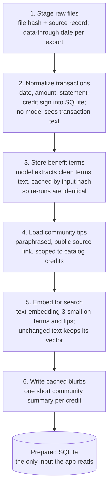

# PerkWatch Problem, Data and Evaluation

Sep 28, 2026 · Vinod

## Problem definition

### Clarity

Premium cards carry statement credits that reset monthly, quarterly or yearly, and most expire unused. Knowing *what's left* is not enough; people need help deciding *how to use it* before the deadline.

**Approach:** split the job in two.

- **Deterministic core:** code decides whether each credit was used, one regex per credit on statement lines. No model is involved, so the facts are exact.
- **LLM layer:** an agent plans, explains and answers questions on top of those facts, using tool calling and RAG over official terms and community tips. Every dollar amount it writes is checked against the data.

AI is added as a layer for usefulness, not as the foundation, so it could sit on top of an existing tracker without changing how the facts are computed.

### Scoping

| In scope | Out of scope |
| --- | --- |
| 3 cards (Amex Platinum, Sapphire Preferred, Sapphire Reserve), 20 statement credits | Other cards and non-credit perks (lounges, insurance are listed, not tracked) |
| Every period of every credit: used, partly used, missed, at risk | Automated login, bank APIs, scraping |
| Per-benefit chat, wallet Ask, weekly AI plan | Multi-user accounts, auth, hosting |
| Offline data prep and RAG indexes | Live web lookups while answering |
| Evals for retrieval, chat, cost and latency | Push notifications and reminders |

## LLM, agent and RAG setup

One bounded agent on `gpt-4o-mini` powers three features: a per-benefit chat, a wallet-wide Ask, and the weekly plan.

| Part | Setup |
| --- | --- |
| System prompt | Rules: amounts and dates only from context or tools; community tips carry the literal label "Community idea" next to their link; urgent credits first |
| Context | JSON from the tracker. Benefit chat preloads that credit's status, history, terms and tips (no retrieval needed). Wallet Ask gets every credit's current period, sorted by urgency |
| Tools (5) | `search_terms` (RAG, official terms), `search_community_tips` (RAG, community tips), `get_benefit_status`, `get_community_tips`, `propose_mark` (offers a "mark used" button; writes nothing) |
| Budget | At most 4 tool calls per turn, then tools are withdrawn and the model must answer |
| Grounding | After generation, code checks every dollar amount against the context and tool results; the UI shows the result |
| Transparency | Each answer shows its tool trace (tool, query, one-line result); every reply also returns its tokens, latency and cost |
| Memory | The browser resends the conversation each turn; the server stores nothing |

**RAG design:** two separate indexes, official terms and community tips, embedded offline with `text-embedding-3-small`. Search is cosine similarity, top 3, narrowed to a card when the question names one. Retrieval is a tool the agent chooses, not an always-on step: if the benefit is already known, its context is simply preloaded.

## Data processing

### Sources

| Source | Feeds | Privacy |
| --- | --- | --- |
| Statement exports (CSV/OFX) | Tracker only | Local; transaction text never reaches a model |
| Official benefit terms | Terms RAG index + benefit chat context | Public issuer facts |
| Community tips (48, public sources) | Community RAG index + weekly plan | Paraphrased, source-linked, collected offline |
| Credit catalog (20 credits) | Tracker regex + credit metadata | Committed; public facts only |
| Synthetic fixture | Evals, demo, screenshots | Made up; safe to share |

### Normalization

One offline script, `scripts/prepare_data.py`, normalizes the data and builds both RAG indexes. The app never fetches or rewrites data while answering.

**Stable re-runs:** extracted terms are cached by a hash of the source, the model and the prompt version, and embeddings are reused when their text hash is unchanged. Two back-to-back runs on real data reused all 63 extractions with no model calls.

**At runtime** the tracker turns this into facts with no model: for every credit and period, the catalog regex matches statement-credit lines and sets used, partly used, missed or at risk. Those facts become the agent's context.

### Handling PII

- **The model sees only:** a credit's terms, tips, amounts, dates and statuses.
- **The model never sees:** transaction descriptions, account details, filenames or complete transaction rows. `redact_pii` runs before any text is embedded or sent to a model.
- **Storage:** statements, exports, databases and community sources live in a local data directory outside git. A guard script checks this before every commit.
- **Community data:** tips are paraphrased, with no usernames or full discussions, and keep their public source link.
- **Screenshots, demos and evals** use synthetic data; real-data evals run locally only.

### Guardrails

| Guardrail | What it prevents |
| --- | --- |
| Grounding check on every answer | Invented dollar amounts reaching the user unflagged |
| 4-call tool budget, then a forced answer | Runaway loops, unbounded cost and latency |
| `propose_mark` writes nothing; only the user's tap saves a mark | The agent changing user data on its own |
| Separate terms and community indexes, community labelled | A forum tip presented as an issuer rule |
| Unknown benefit IDs rejected with the list of valid IDs | The agent acting on a credit that doesn't exist |
| No web requests while answering | Live scraping, prompt injection from fetched pages |
| Manual login, MFA and consent | Credential storage and automated account access |

## Evals

### Task-specific

The LLM layer is tested at two levels: retrieval quality, and answer quality with code checks plus an LLM judge. Code checks decide pass or fail; the judge only scores usefulness.

| Suite | Tests | Metric |
| --- | --- | --- |
| Retrieval, terms (8 questions) | Does the terms search surface the right benefit? | Recall@3 |
| Retrieval, community (4 questions) | Does the community search surface the right benefit? | Recall@3 |
| Chat (9 cases) | Benefit chat, wallet Ask, weekly plan, and an untracked-card question | All code checks pass, plus a judge score |
| Tracker (23 synthetic, 31 real periods) | The facts the agent is given | Exact status and amount match |

**Chat code checks:** grounding (every dollar amount is in the data), correct amount left and deadline, expected tool called, community ideas labelled, expected credit named, and for an untracked card, no invented amount and a clear "not tracked".

**LLM-as-judge:** a separate judge model (`gpt-4o`, while answers come from `gpt-4o-mini`) gets the context, question and answer, and returns JSON: a 1 to 5 score for how useful and actionable the answer is, plus a one-sentence reason. Each case is judged 3 times and averaged.

### Error handling

| Scenario | Handling | Tested by |
| --- | --- | --- |
| Question about a card or credit the user doesn't hold | Answers that it isn't tracked; invents no amount | Chat case `wallet-untracked-card` |
| Unknown benefit ID in a tool call | Returns an error with the valid IDs to the model, which recovers | Unit test |
| Tool raises an exception or gets bad arguments | Error is returned to the model as the tool result, not raised | Unit test |
| Tool budget exhausted | Extra calls are skipped ("tool budget spent") and the model must answer | Unit test with a fake client |
| Judge returns invalid JSON | Score recorded as none; the run continues | Unit test |
| Statement not yet posted | Status "pending" (shown as "waiting for statement"), not "missed", with a 10-day posting grace period | Tracker unit test |
| Stale embedding (text changed) | Skipped instead of served | Prepare tests |

### Cost

Measured with `evals/run.py --suite perf --repeats 3` (21 requests, synthetic data) using `gpt-4o-mini` list prices ($0.15 in, $0.60 out per million tokens):

| Feature | Mean model calls | Mean prompt tokens | Mean output tokens | Mean cost per request |
| --- | --- | --- | --- | --- |
| Per-benefit chat | 1 | 956 | 151 | $0.0002 |
| Wallet Ask | 2.3 | 9,063 | 136 | $0.0014 |
| Weekly plan | 2 | 7,219 | 376 | $0.0013 |

The full real-data chat suite (9 cases, 15 model calls, 51,200 prompt tokens) cost **$0.009** for the answers. Wallet Ask is the costliest because its context carries every credit; that is the first place to trim if usage grows.

### Latency

Same run, end to end per turn including tool calls:

| Feature | p50 | p95 |
| --- | --- | --- |
| Per-benefit chat | 1.5 s | 1.9 s |
| Wallet Ask | 2.1 s | 4.1 s |
| Weekly plan | 3.3 s | 4.1 s |

Real-data chat cases averaged 2.7 s. Tail latency comes from extra tool round trips, which the 4-call budget caps.

## Results

Measured on Sep 28, 2026, on real data unless noted.

| Suite | Result |
| --- | --- |
| Tracker | 31/31 real periods vs MaxRewards; 23/23 synthetic |
| Retrieval recall@3 | Terms 7/8, community 4/4, combined 11/12 (92%) |
| Chat code checks | 8/9 cases passed |
| LLM judge (`gpt-4o`, 3 runs each) | Mean 4.15 of 5, mean spread 0.67 |

## Error analysis and next steps

| Failure | Cause | Status |
| --- | --- | --- |
| Terms retrieval misses the CLEAR+ credit for "fast lane airport security membership", and its chat case fails | Vocabulary gap: the official CLEAR+ terms never say "airport" or "security". The top result is the Global Entry / TSA PreCheck credit, a reasonable answer the case doesn't accept | Open. Fix: embed a short plain-language summary per credit alongside its terms, or rewrite the query before search |
| Recall dropped after re-running prepare | Terms were re-extracted every run and reworded, shifting embeddings | Fixed: extraction cached by input hash; re-runs are identical |
| 2 chat answers linked community sources unlabelled | Loose label instruction after the community RAG change | Fixed: prompts require the literal label; 0 label failures in the latest run |
| Judge scores swung by up to a point | One sample from the same model as the answerer | Fixed: separate `gpt-4o` judge, averaged over 3 runs |

**Next:** close the CLEAR vocabulary gap, grow the chat suite with prompt-injection and off-topic questions, and trim the wallet context to cut Ask cost.
