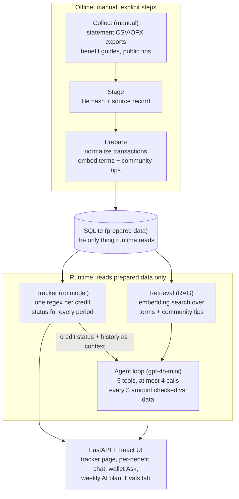

# PerkWatch System Design

Sep 28, 2026 · Vinod

## Overview

PerkWatch tracks every credit-card statement credit, every period, and marks it used, partly used, missed or at risk. It then uses an LLM to help plan how to use what is left before it expires.

**Design principle: deterministic where it counts, AI where it helps.** Whether a credit was used is decided by code: one regex per credit, matched against statement lines, from a hand-checked catalog. No model decides "used". The LLM only explains, plans and answers questions, and every dollar amount it writes is checked against the data.

**Scope:** 3 cards (Amex Platinum, Chase Sapphire Preferred, Chase Sapphire Reserve) and 20 tracked credits on the author's own data. It is a local, single-user app. Data collection (exports, logins, MFA) stays manual by design.

## Architecture

The system splits at SQLite. Everything above it runs offline as explicit, manual steps; everything below it only reads what those steps prepared.

The tracker is pure code and never calls a model. The model sits only in the agent loop, which gets tracker results as context and reaches retrieval through tools.

## Components

Only the agent loop, blurb generation and term extraction call a chat model; the tracker never does.

| Component | Code | Job | Model? |
| --- | --- | --- | --- |
| Staging | `staging/raw_data.py` | Copies user-supplied files into the data dir with a hash and a source record | No |
| Prepare | `prepare/run.py`, `scripts/prepare_data.py` | Normalizes transactions into SQLite, stores benefit terms and community tips, builds embeddings and cached blurbs | Embeddings, term extraction, blurbs |
| Catalog | `catalog.json`, `catalog.py` | Hand-checked public facts: each credit's amount, period and statement-line regex | No |
| Tracker | `runtime/tracker.py` | Walks every period of every credit and sets used / partial / missed / at risk from matched statement credits | No |
| Retrieval | `runtime/retrieval/search.py` | Cosine search over stored embeddings of official terms and community tips, narrowed to a card when the question names one | Query embedding only |
| Agent loop | `runtime/chat.py` | Per-benefit chat, wallet Ask and the weekly plan: a bounded tool-calling loop with a dollar-grounding check | gpt-4o-mini |
| API + UI | `api/app.py`, `web/` | FastAPI on :8000, React/Vite UI on :5173, including an Evals tab | No |
| Evals | `evals/run.py`, `evals/suites.py` | Tracker, retrieval and chat suites on a synthetic fixture, with an optional real-data run | Chat suite + LLM judge |

## Agent loop

One bounded tool-calling loop on `gpt-4o-mini` serves three features: the per-benefit chat, the wallet-wide Ask, and the weekly plan on the home page.

**What the model sees, in order:**

1. **System prompt:** rules. Dollar amounts, dates and days left must come from the context or a tool result; community tips are labelled the literal label "Community idea" next to their link; urgent credits come first.
2. **Context, as JSON:** for a benefit chat, that credit's status, full period history, official terms and its community tips, preloaded because the benefit is already known. For wallet Ask and the weekly plan, the current period of every credit, sorted most urgent first.
3. **The conversation so far**, then the user's question.

**Tools (5):**

| Tool | What it does |
| --- | --- |
| `get_benefit_status` | Current period and history for one credit |
| `search_terms` | RAG search over official issuer terms |
| `search_community_tips` | RAG search over community tips and ideas |
| `get_community_tips` | Tips for one known benefit (used by the weekly plan) |
| `propose_mark` | Offers a one-tap "mark used" button for a manual credit; writes nothing |

**Budget:** at most 4 tool calls per turn. After the fourth, tools are withdrawn and the model must answer with what it has.

**Grounding check:** after generation, code compares every dollar amount in the answer with the context and tool results. The UI shows the check ("N amounts found in your data") and flags any amount it cannot find.

**Transparency:** every answer shows its tool trace (tool, query, one-line result), so a user can see how it got there. Each reply also returns its tokens, latency and cost.

**Memory:** the browser keeps each chat and resends the whole conversation with every question. The server is stateless and stores no chat history.

## Retrieval (RAG)

Retrieval is a tool the agent chooses to call, not a step that runs on every question. When the benefit is already known, its terms and tips are simply loaded into context instead.

- **What is embedded:** official benefit terms, and community tips and ideas (paraphrased, each with a public source link). Transactions are never embedded.
- **When:** at prepare time, offline, with `text-embedding-3-small`. Each vector stores its model and a content hash, so stale vectors are skipped instead of served. At runtime only the question is embedded.
- **Search:** cosine similarity over the stored vectors, a minimum score of 0.2, top 3 results. When a question names a card, the search is narrowed to that card first.
- **Two separate searches:** `search_terms` returns official rules; `search_community_tips` returns ideas labelled as community, never as rules. Keeping them apart stops a forum tip being presented as an issuer policy.
- **Why a tool, not always-on retrieval:** most wallet questions are about amounts and deadlines already in context. Retrieving on every turn would add tokens and noise; the agent calls a search only when the question is about coverage or ideas.

## Privacy and safety boundaries

The model never sees raw financial records, and nothing at runtime logs in, scrapes or writes on the user's behalf.

- **What the model may see:** a credit's terms, tips, amounts, dates and statuses.
- **What it never sees:** transaction descriptions, account details, filenames or complete transaction rows. `redact_pii` runs before any text is embedded or sent to a model.
- **Manual by design:** login, MFA, CAPTCHA, account selection and consent. There are no bank APIs, no credential storage and no automated scraping.
- **One runtime write:** "mark used" for credits a statement can't show (for example a credit paid inside a partner app). The agent can only *propose* it with `propose_mark`; the user's tap writes it to `user/profile.json`.
- **No live lookups while answering:** the app makes no web requests except model calls. Community tips are collected offline from public pages, paraphrased, and stored with their source link.
- **What stays out of git:** statements, exports, databases, community sources and generated output live in a local data directory. Only the hand-checked catalog of public issuer facts is committed, and a guard script checks this before each commit.

## Trade-offs

| Decision | Chose | Over | Why |
| --- | --- | --- | --- |
| Deciding "used" | One regex per credit on statement-credit lines | An LLM matching transactions to credits | Exact, testable and free; it matches MaxRewards on 31/31 real periods |
| Known-benefit questions | Preload that credit's terms, tips and history | Retrieving on every question | Complete context with no retrieval misses; RAG is kept for open questions |
| When to retrieve | Retrieval as a tool the agent chooses | Always-on retrieval before every answer | Fewer tokens and less noise; most questions are about amounts already in context |
| Retrieval indexes | Two: official terms and community tips | One mixed index | A forum tip can't be presented as an issuer rule |
| Answer model | `gpt-4o-mini` | A larger model | $0.0002 to $0.0014 per request at 1.5 to 3.3 s p50; answers judge at 4.15 of 5 |
| Judge model | `gpt-4o`, averaged over 3 runs | The answering model, one run | Removes self-grading bias and cuts score noise, at a small eval-only cost |
| Vector store | Vectors as JSON in SQLite, cosine in Python | A vector database | About 120 vectors; no extra infrastructure to run |
| Agent shape | Bounded loop: 5 tools, at most 4 calls | An open-ended agent | Predictable cost and latency; the loop must end with an answer |
| Data collection | Manual exports | Bank APIs or scraping | No credentials stored, no terms-of-service risk; costs the user a few minutes |

## Error handling

- **Tool errors** (bad arguments, exceptions, unknown benefit IDs) are returned to the model as the tool result, so it can recover instead of crashing the turn.
- **Tool budget:** after 4 calls, tools are withdrawn and extra calls are answered with "tool budget spent", so the model always ends with an answer.
- **Unverified amounts** are flagged in the reply and shown in the UI.
- **Missing data:** a period whose statement hasn't posted yet is "pending", not "missed", with a 10-day posting grace period.
- **Stale vectors** (text changed since embedding) are skipped, not served.
- **Evals:** invalid judge JSON is recorded as no score and the run continues.

Each of these is covered by a unit test or eval case; see the problem, data and evaluation notes.

## Tech stack, cost and latency

| Layer | Choice |
| --- | --- |
| Language | Python (backend, prep, evals), TypeScript (UI) |
| Storage | SQLite, one local file of prepared data |
| API | FastAPI + Uvicorn |
| UI | React + Vite |
| Chat model | OpenAI `gpt-4o-mini` |
| Judge model | OpenAI `gpt-4o` (evals only) |
| Embeddings | OpenAI `text-embedding-3-small` |
| Tests | `unittest` (117 tests), plus a local-data guard script |

**Cost and latency** (measured, synthetic data, 21 requests): per-benefit chat costs $0.0002 per request at 1.5 s p50; wallet Ask $0.0014 at 2.1 s p50 (4.1 s p95); the weekly plan $0.0013 at 3.3 s p50. Every reply returns its tokens, latency and cost, and `evals/run.py --suite perf` reports them per feature.

## Known limitations and next steps

- **Credits that never reach a statement** (for example a DoorDash credit spent inside the app) can't be detected by regex. They are tracked manually with a user-confirmed mark.
- **Vocabulary gap in terms retrieval:** the question "fast lane airport security membership" misses the CLEAR+ credit because its official terms never say "airport" or "security". Next step: embed a short plain-language summary per credit alongside its terms.
- **Wallet Ask context is large** (about 9,000 prompt tokens) because it carries every credit. Next step: send only at-risk and open credits by default.
- **Untested adversarial input:** prompt-injection and off-topic questions aren't in the eval set yet.
- **Single user, local only:** no auth, no multi-user storage, and card coverage is limited to the 3 cards in the catalog.
